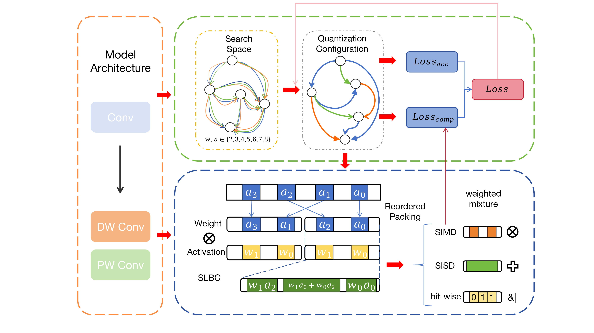

# MCU-MixQ: A HW/SW Co-optimized Mixed-precision Neural Network Design Framework for MCUs

## Overview
MCU-MixQ is a groundbreaking hardware-software co-design framework tailored for resource-constrained microcontrollers. It addresses the challenges of running neural networks on MCUs by leveraging the following key technologies:

+ **Low-bitwidth SIMD Instruction Packing**: Efficiently packs multiple arithmetic operations into single SIMD instructions to maximize computational parallelism.
+ **Optimized Convolution Operators**: Designs high-performance convolution kernels by integrating data-level and compute-level parallelism.
+ **Neural Architecture Search (NAS) for Quantization**: Implements a NAS-based co-optimization quantization approach to balance network performance and accuracy.



## Usage
First, leveraging NAS to perform QAT.
```bash
python MCU-MixQ/QAT/quantization_aware_train.py
```
After quantization, depoly model to MCU using MCU-MixQ.
```bash
bash scripts/deploy.sh --model {model_path}
```

## Acknowledgments
We would like to express our sincere gratitude to the creators of [TinyEngine](https://github.com/mit-han-lab/tinyengine), whose pioneering work laid the essential foundation for MCU-MixQ. The original project not only inspired our research direction but also provided valuable methodologies and codebase that significantly accelerated our development process. Their open-source spirit and technical achievements have been instrumental in enabling us to explore the frontiers of mixed-precision neural network design for microcontrollers.
